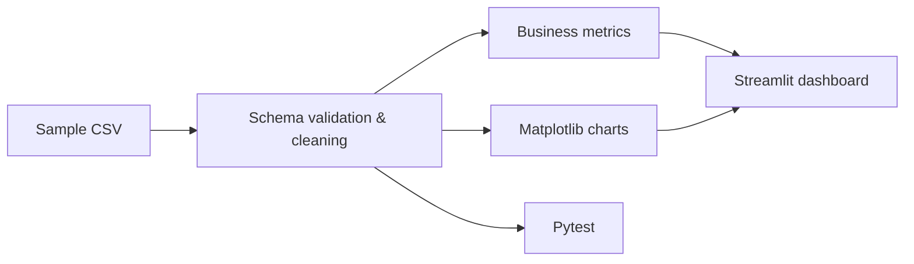

# E-commerce Conversion Analysis

[](https://github.com/theDAREK497/ecommerce-conversion-analysis/actions/workflows/ci.yml)

A compact Python analytics project for exploring website performance and conversion metrics through reusable processing functions, visualizations and a Streamlit dashboard.

> **Scope:** portfolio/data-analysis showcase built around sample CSV data. The bundled data is illustrative rather than a real commercial dataset.

## What it analyses

The dashboard focuses on:

- average page-load time;
- overall conversion rate;
- overall bounce rate;
- conversion by device type;
- the relationship between page-load time and bounce rate;
- the source observations used to calculate the metrics.

## Architecture



The Streamlit layer is intentionally thin. Reusable analytical logic lives under `src/`, which keeps metric definitions independently testable.

## Tech stack

- Python 3.13
- Pandas
- Matplotlib
- Streamlit
- Pytest
- Ruff / Bandit / pip-audit
- GitHub Actions

## Quick start

```bash
git clone https://github.com/theDAREK497/ecommerce-conversion-analysis.git
cd ecommerce-conversion-analysis

python -m venv .venv
```

Install dependencies and run the dashboard:

```bash
python -m pip install -r requirements.txt
streamlit run app/dashboard.py
```

## Validation

```bash
python -m pip install -r requirements-dev.txt
ruff check src app tests
python -m pytest -q
bandit -r src app -q
pip-audit -r requirements.txt
```

CI runs the same linting, tests, security scan and dependency audit on every push and pull request.

## Sample metrics

For the bundled five-row sample dataset, the expected headline values are:

- average page load: **3.42 seconds**;
- conversion rate: **60%**;
- bounce rate: **48%**.

These values are covered by automated tests so changes to the metric definitions are visible in CI.

## Project structure

```text
app/
  dashboard.py          Streamlit presentation layer
data/
  sample_data.csv       illustrative dataset
src/
  data_processing.py    validation, cleaning and metric calculations
  visualization.py      reusable Matplotlib figures
tests/
  test_data_processing.py
  test_dashboard.py
notebooks/               exploratory analysis
docs/                    supporting output
requirements.txt         runtime dependencies
requirements-dev.txt     test / quality tooling
```

## Limitations

This repository demonstrates implementation quality and analytical structure, not a production e-commerce study.

A larger version could add:

- time-series conversion trends;
- funnel-stage analysis;
- traffic-source segmentation;
- experiment confidence intervals;
- automated data-quality reports;
- warehouse or database inputs;
- deployable dashboard infrastructure.

## License

MIT. See [LICENSE](LICENSE).
