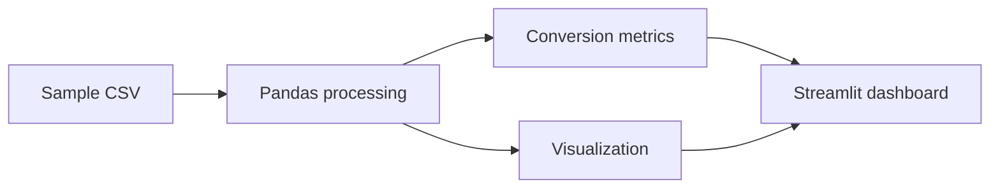

# E-commerce Conversion Analysis

A compact Python analytics project for exploring website performance and conversion metrics through reusable processing functions, visualizations and a Streamlit dashboard.

> **Scope:** portfolio/data-analysis showcase built around sample CSV data.

## What it analyses

The current dashboard focuses on:

- average page-load time;
- overall conversion rate;
- conversion by device type;
- the underlying sample observations used to calculate the metrics.

## Dashboard

The Streamlit app loads `data/sample_data.csv`, calculates summary metrics and renders a conversion-by-device visualization.



## Tech stack

- Python
- Pandas
- Matplotlib
- Streamlit
- Jupyter Notebook
- CSV-based sample data

## Quick start

```bash
git clone https://github.com/theDAREK497/ecommerce-conversion-analysis.git
cd ecommerce-conversion-analysis

python -m venv .venv
```

Windows:

```powershell
.\.venv\Scripts\Activate.ps1
pip install -r requirements.txt
```

Run the dashboard:

```bash
streamlit run app/dashboard.py
```

For notebook-based exploration:

```bash
jupyter notebook
```

## Project structure

```text
app/
  dashboard.py        Streamlit UI
data/
  sample_data.csv     example dataset
src/
  data_processing.py  loading and metric calculations
  visualization.py    chart generation
notebooks/             exploratory analysis
docs/                  generated images / supporting output
requirements.txt
```

## Why the project is structured this way

Even for a small analysis, keeping metric calculation and visualization outside the UI makes the code easier to reuse and test.

The Streamlit layer is responsible for presentation, while `src/` contains the reusable analytical logic.

## Limitations

The bundled dataset is a sample, so the dashboard should be read as an implementation example rather than as a real commercial performance study.

A larger version could add:

- time-series conversion trends;
- funnel stages;
- traffic-source segmentation;
- confidence intervals / experiment analysis;
- automated data-quality checks;
- database or warehouse input;
- deployable dashboard infrastructure.

## License

MIT. See [LICENSE](LICENSE).
